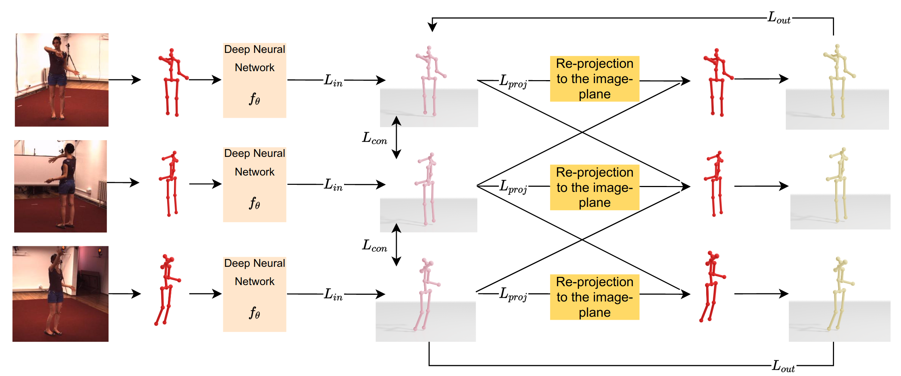

[](https://paperswithcode.com/sota/weakly-supervised-3d-human-pose-estimation-on?p=self-supervised-3d-human-pose-estimation-with)

# Self-Supervised 3D Human Pose Estimation with Multiple-View Geometry


Official PyTorch Implementation of the paper: Self-Supervised 3D Human Pose Estimation with Multiple-View Geometry".
<br>
Arij Bouazizi, Julian Wiederer, Ulrich Kressel, Vasileios Belagiannis
<br>
**Best Poster Award at [FG 2021](http://iab-rubric.org/fg2021/awards.html)*
<br>

[[PDF](https://ieeexplore.ieee.org/abstract/document/9667074)] [[PapersWithCode](https://paperswithcode.com/paper/self-supervised-3d-human-pose-estimation-with)] [[Arxiv](https://arxiv.org/abs/2108.07777)]


<div align="left">

</div>

## Installation

To setup the environment:
```sh
cd Pose_3D
conda create -n Pose_3D python=3.8.8
conda activate Pose_3D
pip install -r requirements.txt
```

## Data

Due to licensing it is not possible to provide any data from Human3.6M. However, for training only 2D keypoints from a pretrained 2D detector are needed. 
Our detections are from [VPose3D](https://github.com/facebookresearch/VideoPose3D). You can download the 2D detections and the triangulated keypoints from from [Google Drive](https://drive.google.com/drive/folders/1UgYTc0YZnM0nhv9DreeIeD0PRbgmlwCC?usp=sharing).

Please refer to [`DATASETS.md`](./DATASETS.md) for the preparation of the dataset files. 

## Models

We release the pretrained models for academic purpose. You can download them from [Google Drive](https://drive.google.com/drive/folders/1P1tN9lVuOyfdh0Xhx-w1TYGElJoz_zvC?usp=sharing). 


## Citation

If you find this code useful for your research, please consider citing the following paper:

```latex
@inproceedings{bouazizi2021self,
  title={Self-supervised 3d human pose estimation with multiple-view geometry},
  author={Bouazizi, Arij and Wiederer, Julian and Kressel, Ulrich and Belagiannis, Vasileios},
  booktitle={2021 16th IEEE International Conference on Automatic Face and Gesture Recognition (FG 2021)},
  pages={1--8},
  year={2021},
  organization={IEEE}
}
```

## License

<a rel="license" href="http://creativecommons.org/licenses/by-nc/4.0/">
</a><br />This work is licensed under <a rel="license" href="http://creativecommons.org/licenses/by-nc/4.0/"
 >Creative Commons Attribution-NonCommercial 4.0 International License</a>.

